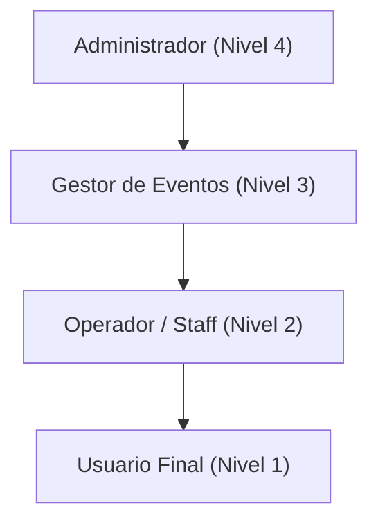
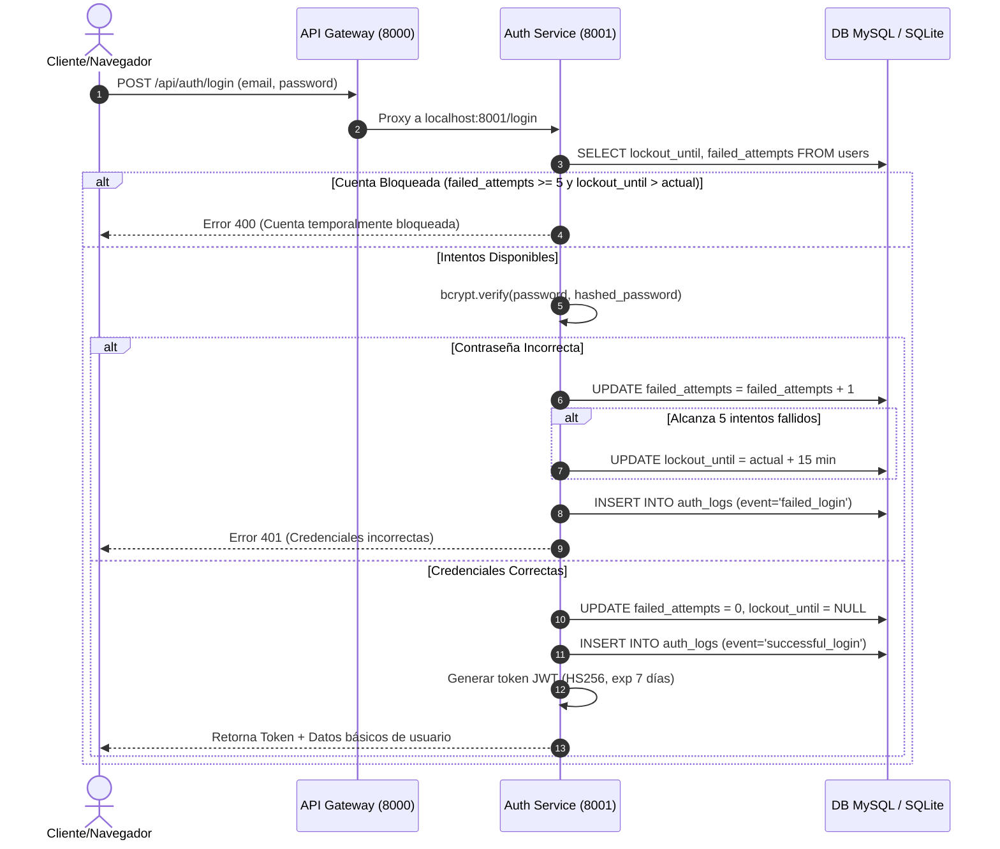
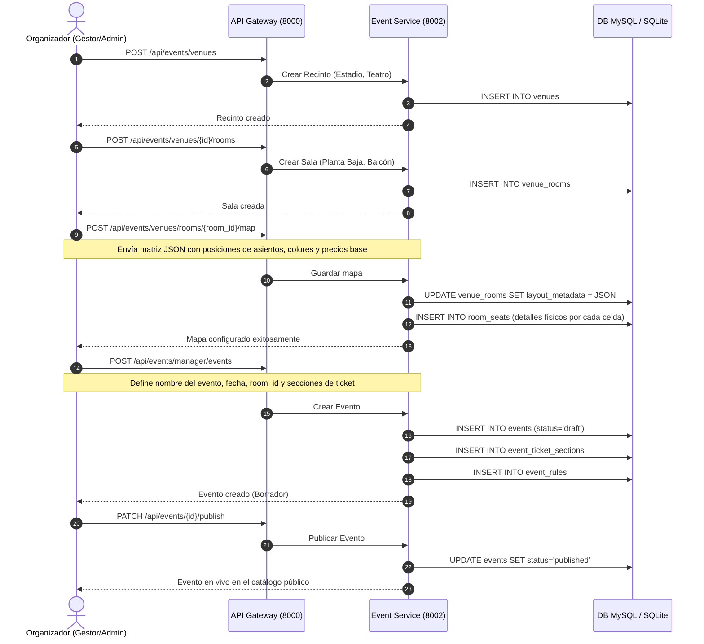
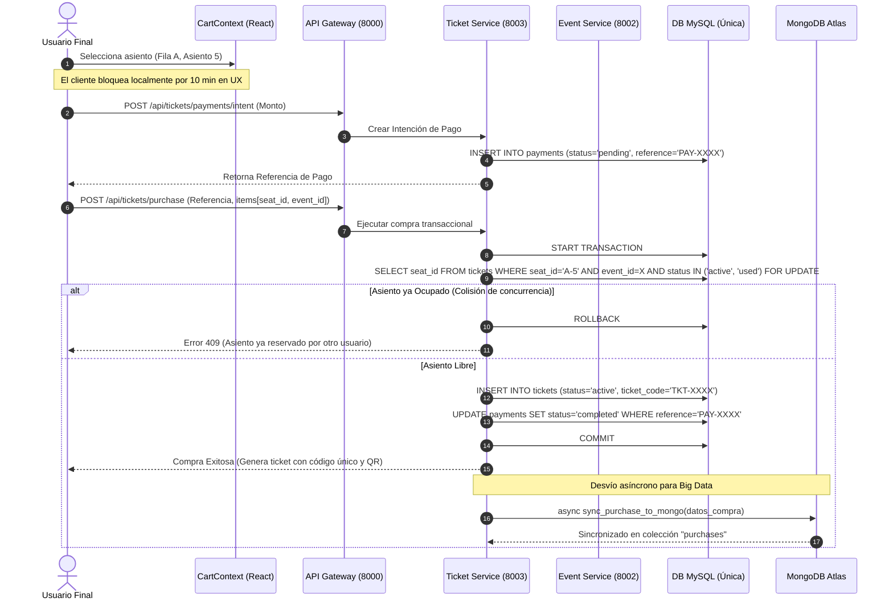
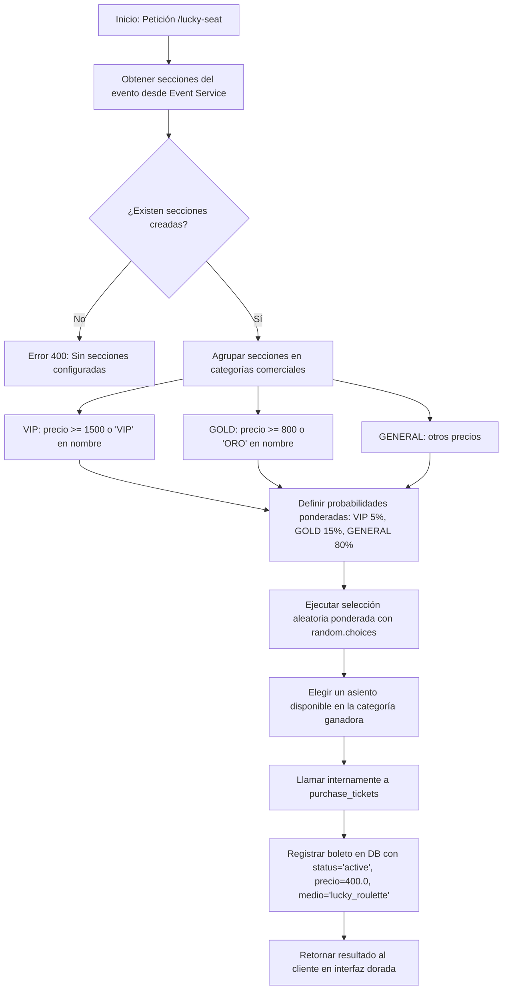
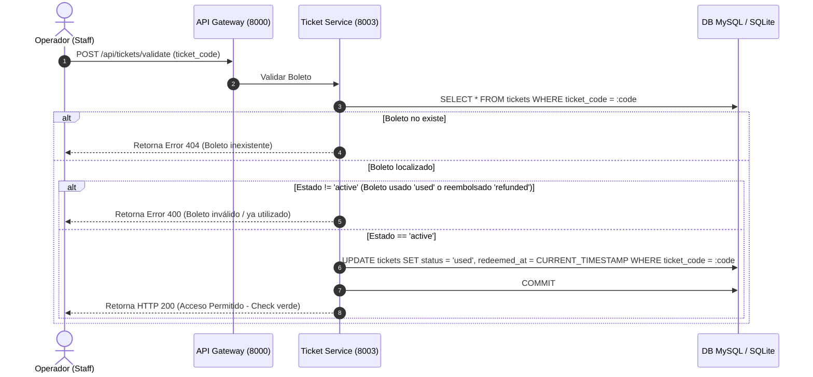
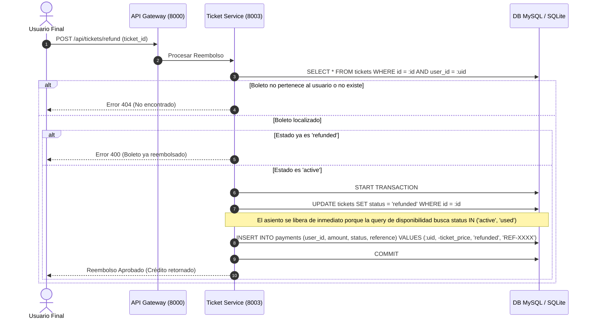
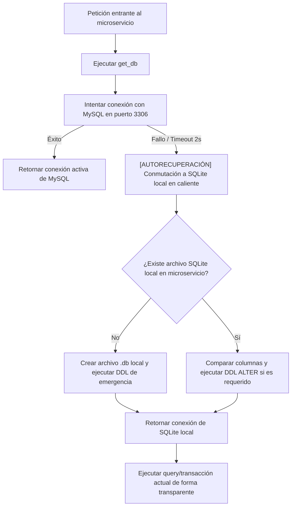
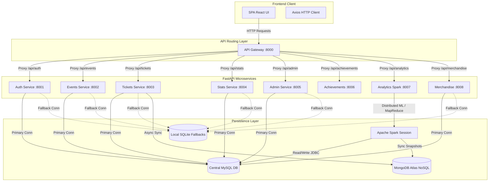

# MANUAL TÉCNICO DE ARQUITECTURA Y ONBOARDING ESTRUCTURAL: LAIKA CLUB
**Para: Desarrolladores, Arquitectos de Software y Líderes Técnicos**  
**Autor: Arquitecto de Software Senior / Tech Lead**  
**Versión: 2.0.0**  
**Fecha: 26 de Junio de 2026**  

---

## 1. INTRODUCCIÓN Y CONTEXTO DEL SISTEMA

Laika Club es un sistema enterprise híbrido y distribuido diseñado para la gestión de espectáculos masivos, reservas interactivas de asientos, gamificación para usuarios VIP y procesamiento analítico de grandes volúmenes de transacciones comerciales. El sistema opera sobre una topología de microservicios con resiliencia en caliente, permitiendo una degradación elegante del almacenamiento ante interrupciones de infraestructura.

---

## 2. ESTRUCTURA DE ROLES Y PERMISOS (RBAC)

El sistema implementa un modelo de Control de Acceso Basado en Roles (RBAC) con una jerarquía de niveles que define la herencia de permisos y restringe las capacidades de navegación tanto en la interfaz de usuario (React) como en los servicios del backend (FastAPI).

### 2.1 Jerarquía de Roles
La jerarquía se encuentra configurada en `src/core/config/roles.config.js` y asigna un nivel numérico de criticidad:



| Rol | Identificador | Nivel | Descripción Corta |
| :--- | :--- | :---: | :--- |
| **Administrador** | `admin` | 4 | Control total del sistema, administración de base de datos, backups, auditoría general, email masivo y aprobaciones de catálogo. |
| **Gestor de Eventos**| `gestor` | 3 | Creación y administración de eventos, recintos, diseño matricial de salas y parametrización de mercancía local. |
| **Operador (Staff)** | `operador` | 2 | Operaciones en campo (puerta del recinto), validación física de boletos mediante lector de códigos QR y control de incidencias. |
| **Usuario Final** | `usuario` | 1 | Registro, consulta del catálogo público de eventos, compra interactiva de boletos, acceso a Wallet personal y solicitudes de devoluciones. |

### 2.2 Validación de la Autenticación y Autorización

#### Capa de Autenticación (JWT y Sesión)
1. **Generación del Token:** El inicio de sesión se procesa a través del microservicio `/api/auth/login`. Si las credenciales son válidas, se genera un token de acceso JWT (Json Web Token) utilizando codificación simétrica **HS256** firmado por la clave global `JWT_SECRET`.
2. **Payload del Token:** Contiene los claims esenciales del usuario:
   ```json
   {
     "user_id": 12,
     "role": "gestor",
     "exp": 1782484000
   }
   ```
3. **Persistencia del Estado (Frontend):** Al recibir la respuesta del login exitoso, el frontend almacena el token y la información del usuario en el navegador utilizando las claves de configuración centralizada en `app.config.js`:
   * `token` -> Contiene el token JWT principal.
   * `user` -> Objeto con nombre, correo y rol del usuario para renderizado inmediato.
   * `sessionToken` -> Token de tracking de sesión con expiración inactiva por defecto de 30 minutos.

#### Capa de Autorización (Frontend - React)
* **ProtectedRoute.jsx:** Envuelve las páginas privadas. Recupera el rol guardado en el contexto global de autenticación (`AuthContext.jsx`) y lo evalúa contra la lista de roles permitidos (`allowedRoles`) de la ruta actual usando el helper `canAccess(userRole, allowedRoles)` de `roles.config.js`.
* **Protección de Elementos de Interfaz:** Se utiliza la función `hasPermission(role, module, action)` para ocultar o deshabilitar condicionalmente botones o paneles de control específicos (ej: el botón de crear evento solo es visible para `admin` y `gestor`).

#### Capa de Autorización (Backend - FastAPI)
* **Descentralización del Token:** Los microservicios no consultan al Auth Service en cada petición de autorización. En su lugar, cada microservicio tiene acceso a la clave compartida `JWT_SECRET` en sus variables de entorno.
* **get_current_user:** Utilizando la dependencia de FastAPI `Depends(get_current_user)` (definida en el archivo local `security.py` de cada contenedor), el backend decodifica la cabecera `Authorization: Bearer <token>` y extrae directamente el ID y rol de usuario para aplicar lógica de restricción de forma local.

---

## 3. MATRIZ DE FUNCIONES POR ROL Y MÓDULO

A continuación, se detalla exhaustivamente qué acciones específicas puede realizar cada rol dentro del sistema, vinculándolas al microservicio y controlador correspondiente.

| Módulo / Controlador | Acción de Negocio | Endpoint del Gateway (Backend) | admin | gestor | operador | usuario |
| :--- | :--- | :--- | :---: | :---: | :---: | :---: |
| **Auth / Users** | Crear cuenta de usuario | `POST /api/auth/register` | | | | ✔ |
| | Login (Credenciales / OAuth) | `POST /api/auth/login` | ✔ | ✔ | ✔ | ✔ |
| | Ver perfil propio | `GET /api/auth/users/me` | ✔ | ✔ | ✔ | ✔ |
| | Modificar avatar perfil | `POST /api/auth/users/me/avatar`| ✔ | ✔ | ✔ | ✔ |
| | Obtener lista de usuarios | `GET /api/auth/admin/users` | ✔ | | | |
| | Bloquear/Desbloquear usuario | `PATCH /api/auth/admin/users/{id}/unlock` | ✔ | | | |
| | Forzar cambio de password | `PATCH /api/auth/admin/users/{id}/password` | ✔ | | | |
| | Cambiar rol / permisos | `PUT /api/auth/users/{id}/permissions` | ✔ | | | |
| | Solicitar permisos (ascenso) | `POST /api/auth/request-permission` | | ✔ | ✔ | ✔ |
| | Ver solicitudes de permisos | `GET /api/auth/all-requests` | ✔ | | | |
| | Descargar auditoría accesos | `GET /api/auth/audit` | ✔ | ✔ | | |
| **Events / Venues** | Listar eventos públicos | `GET /api/events/public` | ✔ | ✔ | ✔ | ✔ |
| | Crear evento borrador | `POST /api/events/manager/events` | ✔ | ✔ | | |
| | Modificar datos de evento | `PUT /api/events/{event_id}` | ✔ | ✔ | | |
| | Publicar evento catálogo | `PATCH /api/events/{id}/publish` | ✔ | ✔ | | |
| | Despublicar evento | `PATCH /api/events/{id}/unpublish`| ✔ | ✔ | | |
| | Crear recinto (Venue) | `POST /api/events/venues` | ✔ | | | |
| | Crear salas físicas (Rooms) | `POST /api/events/venues/{id}/rooms` | ✔ | ✔ | | |
| | Configurar mapa de asientos | `POST /api/events/venues/rooms/{id}/map` | ✔ | ✔ | | |
| | Consultar localizaciones (Geo)| `GET /api/events/venues/locations/*`| ✔ | ✔ | ✔ | ✔ |
| **Tickets / Payments**| Bloqueo temporal en carrito | *Lógica Frontend (CartContext)* | | | | ✔ |
| | Comprar boletos | `POST /api/tickets/purchase` | | | | ✔ |
| | Crear intención de pago | `POST /api/tickets/payments/intent`| | | | ✔ |
| | Confirmar pago / Emitir ticket | `POST /api/tickets/payments/confirm`| | | | ✔ |
| | Monedero (Wallet) de boletos | `GET /api/tickets/my-tickets` | ✔ | ✔ | ✔ | ✔ |
| | Escanear / Redimir QR ticket | `POST /api/tickets/validate` | ✔ | | ✔ | |
| | Registrar incidencia en puerta | `POST /api/tickets/incidents` | ✔ | | ✔ | |
| | Reclamar reembolso de boleto | `POST /api/tickets/refund` | | | | ✔ |
| | Listar historial reembolsos | `GET /api/tickets/refund` | | | | ✔ |
| | Ruleta Lucky Seat (Sorteo) | `POST /api/tickets/lucky-seat` | | | | ✔ |
| **Stats / Monitoring**| Resumen global dashboard | `GET /api/stats/admin/dashboard`| ✔ | | | |
| | Panel de métricas del gestor | `GET /api/stats/manager/dashboard`| ✔ | ✔ | | |
| | Métricas hardware (CPU/RAM) | `GET /api/stats/metrics` | ✔ | | | |
| | Visualización logs servidores | `GET /api/stats/logs` | ✔ | | | |
| **Admin Database** | Listar historial de backups | `GET /api/database/backups` | ✔ | | | |
| | Generar backup manual (MySQL/NoSQL)| `POST /api/database/backup` | ✔ | | | |
| | Descargar dump .sql / .json | `GET /api/database/backups/{id}/download`| ✔ | | | |
| | Restaurar base de datos | `POST /api/database/restore` | ✔ | | | |
| | Exportar datos (Excel/JSON/PDF) | `GET /api/database/export/{format}`| ✔ | | | |
| | Optimizar tablas MySQL | `POST /api/database/optimize` | ✔ | | | |
| | Configurar backup automático | `PUT /api/database/automatic-backup/config`| ✔ | | | |
| | Enviar correo masivo (Broadcast)| `POST /api/auth/admin/broadcast` | ✔ | | | |
| **Merchandise** | Crear producto en bazar | `POST /api/merchandise/` | ✔ | ✔ | | |
| | Editar stock / datos producto | `PUT /api/merchandise/{id}` | ✔ | ✔ | | |
| | Aprobar producto para venta | `PUT /api/merchandise/{id}/admin_status`| ✔ | | | |
| | Crear orden de compra | `POST /api/merchandise/orders/` | | | | ✔ |
| **Achievements** | Consultar XP y logros | `GET /api/achievements/` | ✔ | ✔ | ✔ | ✔ |
| | Consultar cupones activos | `GET /api/achievements/coupons` | | | | ✔ |
| **Big Data Analytics**| MapReduce de compras (Spark)| `GET /api/analytics/mapreduce` | ✔ | | | |
| | Análisis tridimensional (3D) | `GET /api/analytics/3d` | ✔ | | | |
| | Ejecutar regresiones (Ridge/Lasso)| `GET /api/analytics/ml/regression`| ✔ | | | |
| | Árboles decisión clasificación | `GET /api/analytics/ml/decision-tree`| ✔ | | | |
| | Inteligencia proactiva (Sold-Out)| `GET /api/analytics/intelligence`| ✔ | | | |
| | Sincronización Bóveda NoSQL | `POST /api/analytics/vault/sync`| ✔ | | | |

---

## 4. FLUJOS CRÍTICOS DE NEGOCIO

Esta sección documenta el paso a paso de las transacciones prioritarias del sistema, mostrando las llamadas entre la interfaz, el Gateway, los microservicios y las bases de datos.

### 4.1 Autenticación, Auditoría y Política de Bloqueo

Asegura el acceso al sistema aplicando políticas estrictas para evitar ataques de fuerza bruta.



---

### 4.2 Creación de Eventos y Configuración de Aforos/Asientos SVG

Los organizadores definen físicamente dónde se sentarán los compradores a través de un editor de cuadrícula interactiva.



---

### 4.3 Compra de Tickets y Bloqueo de Asientos

El flujo más crítico del negocio. Asegura la prevención de doble compra ("double-booking") bajo alta concurrencia de usuarios.



---

### 4.4 Ruleta "Lucky Seat" (Algoritmo de Asignación)

Un minijuego de mercadotecnia en el cual el usuario arriesga un monto fijo a cambio de la posibilidad de ganar un boleto en una sección de mayor precio.



---

### 4.5 Validación QR y Control de Acceso en Puerta

Llevado a cabo por operadores en el recinto el día del espectáculo utilizando dispositivos móviles o terminales de escaneo.



---

### 4.6 Reembolsos y Liberación Automática de Asientos

Permite a los usuarios revertir compras elegibles. La liberación de asientos se hace de forma inmediata y automática debido al diseño lógico del estado.



---

### 4.7 Protocolo de Autorecuperación de Base de Datos (Self-Healing Fallback)

Lógica distribuida a nivel de controlador que garantiza la disponibilidad de lectura/escritura de los microservicios si el servidor de base de datos relacional primario (MySQL) sufre una desconexión.



---

## 5. MAPEO DE ENDPOINTS Y ACCESOS

El API Gateway (`gateway.py`) expuesto en el puerto `8000` centraliza el ruteo de peticiones. A continuación se detallan los mapeos de prefijos de rutas con los microservicios subyacentes y las restricciones de roles para cada segmento de la API.

```
                  +----------------------------------------------+
                  |               CLIENTE CLIENT                  |
                  +----------------------------------------------+
                                         |
                                         v
                  +----------------------------------------------+
                  |         API GATEWAY (gateway.py:8000)        |
                  +----------------------------------------------+
                                         |
        +------------------+-------------+-------------+------------------+
        |                  |                           |                  |
        v                  v                           v                  v
+---------------+  +---------------+           +---------------+  +---------------+
| /api/auth     |  | /api/events   |           | /api/tickets  |  | /api/database |
| (Auth:8001)   |  | (Events:8002) |           | (Tickets:8003)|  | (Admin:8005)  |
+---------------+  +---------------+           +---------------+  +---------------+
```

### 5.1 Tabla de Endpoints de la API
| Ruta Prefijo | Destino Interno | Puerto | Rol Mínimo Requerido | Descripción |
| :--- | :--- | :---: | :---: | :--- |
| `/api/auth/login` | `auth` | 8001 | *Público* | Autenticación de credenciales. |
| `/api/auth/register` | `auth` | 8001 | *Público* | Alta de nuevos usuarios. |
| `/api/auth/users/me` | `auth` | 8001 | `usuario` | Datos del perfil de sesión. |
| `/api/auth/admin/*` | `auth` | 8001 | `admin` | Mantenimiento y bloqueo de cuentas. |
| `/api/auth/audit` | `auth` | 8001 | `gestor` | Logs de acceso e inicios de sesión. |
| `/api/events/public` | `events` | 8002 | *Público* | Listar catálogo (con caché de 60s en Gateway).|
| `/api/events/manager/*`| `events` | 8002 | `gestor` | CRUD de eventos e inicialización de recintos. |
| `/api/venues` | `events` | 8002 | `gestor` | Crear recintos y salas de espectáculos. |
| `/api/tickets/purchase`| `tickets`| 8003 | `usuario` | Proceso de compra con bloqueo de asientos. |
| `/api/tickets/validate`| `tickets`| 8003 | `operador`| Escaneo e invalidación de QR de boletos. |
| `/api/tickets/refund` | `tickets`| 8003 | `usuario` | Solicitud de devoluciones financieras. |
| `/api/tickets/lucky-seat`| `tickets`| 8003| `usuario` | Sorteo de boletos Lucky Seat. |
| `/api/stats/admin/*` | `stats` | 8004 | `admin` | Resumen de ventas e infraestructura global. |
| `/api/stats/manager/*` | `stats` | 8004 | `gestor` | Resumen de ventas del catálogo propio. |
| `/api/stats/logs` | `stats` | 8004 | `admin` | Visor de logs consolidados. |
| `/api/database/*` | `admin` | 8005 | `admin` | Backups, restauraciones y optimizaciones. |
| `/api/ads` | `admin` | 8005 | `gestor` | CRUD de banners de publicidad. |
| `/api/ads/public` | *Hotpatch* | 8000 | *Público* | **(DEUDA TÉCNICA)** Consulta directa SQL. |
| `/api/merchandise` | `merch` | 8008 | `usuario` | Tienda y órdenes de mercancía oficial. |
| `/api/merchandise/*` | `merch` | 8008 | `gestor` | Constructor de productos y stock. |
| `/api/achievements/*` | `achiev` | 8006 | `usuario` | Consulta de XP, medallas y cupones. |
| `/api/analytics/*` | `analytics`| 8007 | `admin` | Procesamiento MapReduce e IA con Spark. |

---

## 6. INTERACCIÓN CON LA BASE DE DATOS

El sistema maneja un esquema híbrido y descentralizado. Los microservicios acceden de manera concurrente al motor relacional principal, pero mantienen bases de datos relacionales independientes locales para soportar el protocolo de autorecuperación. Asimismo, se sincronizan datos transaccionales de forma asíncrona hacia bases NoSQL.

### 6.1 Catálogo de Tablas del Sistema (MySQL central / SQLite local)

```
                       ESQUEMA DE BASE DE DATOS CENTRAL (MySQL)
 
 +------------------+       +------------------+       +-------------------------+
 |      users       |       |      events      |       |  event_ticket_sections  |
 +------------------+       +------------------+       +-------------------------+
 | id (PK)          |       | id (PK)          |       | id (PK)                 |
 | email            |       | name             |<------| event_id (FK)           |
 | password_hash    |       | room_id          |       | name                    |
 | role             |       | status           |       | price                   |
 +------------------+       +------------------+       +-------------------------+
                                      |
                                      v
 +------------------+       +------------------+       +-------------------------+
 |     tickets      |       |     payments     |       |       venues / rooms    |
 +------------------+       +------------------+       +-------------------------+
 | id (PK)          |       | id (PK)          |       | id (PK)                 |
 | user_id (FK)     |       | user_id (FK)     |       | name                    |
 | event_id (FK)    |       | amount           |       | capacity                |
 | ticket_code (UQ) |       | status           |       | layout_metadata (JSON)  |
 +------------------+       +------------------+       +-------------------------+
```

1. **`users` (Gestionada por `auth-service`)**:
   * Almacena datos de cuentas, roles, avatares y contraseñas hasheadas.
   * Campos clave: `lockout_until` (control de acceso), `failed_attempts` (política de bloqueo).
2. **`events` (Gestionada por `event-service`)**:
   * Información del evento.
   * Campos clave: `status` (`draft` o `published`), `use_seating_map` (booleano para activar el mapa SVG), `room_id` (vínculo físico de sala).
3. **`event_ticket_sections` (Gestionada por `event-service`)**:
   * Precios y aforos desglosados por sección para cada evento (ej: General, VIP).
4. **`venue_rooms` y `room_seats` (Gestionada por `event-service`)**:
   * Modelado de las salas físicas de los recintos. `layout_metadata` contiene la definición estructural JSON para renderizado de mapas SVG de asientos interactivos.
5. **`tickets` (Gestionada por `ticket-service`)**:
   * Registros de boletos comprados.
   * Campos clave: `ticket_code` (código criptográfico único), `status` (`active`, `used`, `refunded`, `cancelled`), `seat_id` (coordenadas del asiento en el mapa).
6. **`payments` (Gestionada por `ticket-service`)**:
   * Registro histórico de transacciones financieras.
7. **`ads` y `ad_clicks` (Gestionada por `admin-service`)**:
   * Banners publicitarios y métricas de clicks de usuarios.
8. **`merchandise_items` y `merchandise_orders` (Gestionada por `merchandise-service`)**:
   * Productos y carritos del bazar de recuerdos oficial.
9. **`user_achievements` y `user_coupons` (Gestionada por `achievements-service`)**:
   * Gamificación. Desbloqueo de medallas e insignias según la compra acumulada de boletos.

### 6.2 Matriz de Lectura, Escritura y Borrado Lógico por Rol

El sistema prohíbe las eliminaciones físicas de registros de auditoría y transaccionales para asegurar la integridad de los datos históricos. En su lugar, aplica **borrados lógicos** mediante cambios de estado (`status` o `active`).

* **Lectura (`SELECT`):**
  * `usuario` -> Solo lee tablas públicas (`events`, `venues`), productos aprobados de `merchandise` y sus propios datos en `users`, `tickets`, `payments` y `achievements`.
  * `operador` -> Lee eventos asignados y registros de boletos de acceso para validación.
  * `gestor` -> Lee la totalidad de eventos, mapas, tickets vendidos de sus eventos y sus analíticas de negocio.
  * `admin` -> Lectura global sin restricciones en todas las bases de datos.
* **Escritura e Inserción (`INSERT`):**
  * `usuario` -> Escribe en `users` (registro), `payments` e `intent_payments` (compras), `tickets` (generación de boleto al pagar) y `ad_clicks`.
  * `gestor` -> Escribe en `events`, `venues` (recintos), `venue_rooms` (salas) y `merchandise_items` (bazar).
  * `admin` -> Escribe en todas las tablas, incluyendo `backup_history`, `ads` y variables de configuración en `system_config`.
* **Modificación / Actualización (`UPDATE`):**
  * `usuario` -> Puede actualizar sus datos básicos de perfil (ej. avatar).
  * `operador` -> Modifica el estado del boleto de `active` a `used` y registra `redeemed_at` durante la verificación en puerta.
  * `gestor` -> Modifica la configuración de sus eventos y publica/despublica.
  * `admin` -> Actualizaciones globales. Puede modificar roles de usuarios, resetear contraseñas y desbloquear cuentas.
* **Borrado Lógico (`UPDATE status/active`) y Borrado Físico (`DELETE`):**
  * **Eventos:** El borrado de un evento es lógico. Se actualiza el `status` a `'draft'` o `'cancelled'`.
  * **Publicidad:** Modificar la columna `active = 0` en la tabla `ads` oculta el banner inmediatamente de la API pública.
  * **Asientos de Sala:** Se realiza un borrado lógico actualizando el estado en `room_seats` a `'inactive'`.
  * **Tickets:** Un reembolso actualiza el `status = 'refunded'`. El asiento queda liberado físicamente para futuras consultas de aforo de forma inmediata.

---

## 7. DEPENDENCIAS ARQUITECTÓNICAS Y ECOSISTEMA TECNOLÓGICO

Laika Club se apoya en un conjunto de tecnologías integradas que permiten la orquestación distribuida del sistema y la analítica proactiva.



### 7.1 Componentes Críticos del Ecosistema
1. **API Gateway (`gateway.py`)**: Fachada única de acceso que escucha en el puerto `8000`. Redirige tráfico por ruta, gestiona cabeceras CORS de forma global y almacena en caché de memoria (`GET_CACHE`) las peticiones públicas de eventos por un lapso de 60 segundos para evitar saturar el microservicio de eventos.
2. **Motor de Big Data (`analytics_bigdata`)**:
   * **Apache Spark Session:** Arranca un hilo en segundo plano (`spark_thread`) para inicializar un motor distribuido Spark conectado con librerías JDBC para MySQL y conectores nativos de MongoDB.
   * **Modelos Predictivos:** Ejecuta comparaciones de 6 modelos matemáticos de regresión de ventas (Lineal, Ridge, Lasso, Polinomial de grado 2, etc.) y árboles de decisión para clasificar eventos con alta probabilidad de agotarse ("Sold-Out").
   * **Saneamiento y MapReduce:** Realiza mapeos analíticos para clasificar y limpiar datos masivos de transacciones.
3. **MongoDB Atlas (Bóveda NoSQL)**:
   * **Análisis Offline:** Actúa como almacén de datos desestructurados de transacciones de compra. El microservicio de tickets envía volcados asíncronos en tiempo real mediante `motor.motor_asyncio`.
   * **Vault de Recuperación:** Almacena instantáneas ("snapshots") históricas de las tablas completas de MySQL para auditoría y restauración rápida en caso de desastres.
4. **Protocolo Fallback SQLite**:
   * Implementado mediante SQLAlchemy en el archivo `database.py` de cada microservicio. Si el intento de conexión a MySQL falla tras un timeout de 2 segundos, conmuta automáticamente a bases SQLite individuales (`auth.db`, `events.db`, `tickets.db`, etc.) garantizando que el sistema continúe operando localmente durante el desarrollo o fallas del hosting.

### 7.2 Lógica de Comunicación
* **Comunicación Externa (Cliente-Servidor):** Llamadas REST HTTP síncronas asediadas por un cliente centralizado Axios (`apiClient.js`) con interceptores para inyectar cabeceras JWT y controlar redirecciones.
* **Comunicación Interna (Inter-Microservicios):**
  * **HTTP Directo:** Microservicios como `tickets` o `achievements` consultan datos a otros servicios mediante peticiones HTTP asíncronas internas utilizando la librería `httpx` (ej: `tickets` consulta el detalle de un evento a `events:8002` para agregarlo al Wallet del usuario).
  * **Hilo Asíncrono en Background:** El microservicio `analytics` utiliza multihilo (`threading.Thread`) para evitar que el arranque de Spark (que tarda varios segundos) bloquee la API REST del microservicio.
  * **FastAPI BackgroundTasks:** Tareas pesadas como la generación de volcados SQL (`mysqldump`) o backups de MongoDB son procesadas fuera del hilo principal de petición para no demorar la respuesta HTTP al Administrador.

---

## 8. DEUDA TÉCNICA E INCOHERENCIAS ARQUITECTÓNICAS IDENTIFICADAS

Como Tech Lead, se han identificado las siguientes fallas de diseño de software y deuda técnica crítica que deben corregirse en las siguientes fases de desarrollo:

### 8.1 Fuga de Responsabilidades en el API Gateway (Hotpatching)
* **Archivo:** `gateway.py` (Líneas 60-84)
* **Falla:** El endpoint público `/api/ads/public` no se delega a ningún microservicio. En su lugar, el Gateway importa la librería `pymysql` y realiza una conexión directa a la base de datos MySQL para consultar la tabla `ads` y formatear el JSON.
* **Impacto:** Viola el principio de responsabilidad única de un Gateway (que solo debe enrutar y verificar cabeceras). Introduce dependencias de base de datos relacionales en la capa de enrutamiento y expone al Gateway a caídas si la base de datos falla o cambia de esquema.

### 8.2 Incoherencias de Nomenclatura en la Capa de Servicios del Frontend
* **Ruta:** `src/services/`
* **Falla:** Coexistencia de archivos duplicados o casi idénticos con nombres similares que siguen distintas convenciones de codificación (camelCase vs dot-notation kebab-case):
  * `adminService.js` y `admin.service.js` (Duplicados de 3997 bytes)
  * `authService.js` y `auth.service.js`
  * `eventService.js` y `event.service.js`
  * `ticketService.js` y `ticket.service.js`
* **Impacto:** Los desarrolladores nuevos pueden importar de forma inconsistente el archivo incorrecto. Esto duplica el esfuerzo de mantenimiento de endpoints y expone al sistema a bugs difíciles de rastrear.

### 8.3 Violación del Principio de Cohesión en Hooks de React
* **Ruta:** `src/hooks/`
* **Falla:** Se han ubicado hooks específicos de negocio y con alta dependencia de dominio (`useAdminUsers.js`, `useAuth.js`, `useExternalBackup.js`, `useUserPermissions.js`) en la carpeta raíz de hooks globales.
* **Impacto:** Contradice las pautas del manual de arquitectura modular `src/ARCHITECTURE.md`, que establece que los hooks con lógica exclusiva de una característica deben encapsularse dentro de su carpeta correspondiente en features (ej: `src/features/admin/hooks/useAdminUsers.js`). Esto reduce la portabilidad de los módulos.

### 8.4 Ausencia de Tabla Cruzada en SQLite de Fallback
* **Falla:** En el microservicio `events`, el controlador realiza consultas directas (`JOIN`) contra la tabla `tickets` para generar las métricas de venta de boletos. Si la base de datos MySQL falla y se activa el protocolo SQLite de respaldo, la query fallará, ya que la base de datos local `events.db` no contiene la tabla `tickets` (esta reside en `tickets.db`).
* **Impacto:** El protocolo de tolerancia a fallos queda inutilizado en el dashboard del organizador si se opera de forma local, provocando errores HTTP 500 en las vistas de analíticas de eventos.

### 8.5 Código de Rutas de Depuración Acumulado (Clutter)
* **Carpeta:** `tiradero/`
* **Falla:** Carpeta tiradero en la raíz del proyecto que contiene archivos SQL antiguos, historiales de depuración e importaciones rotas.
* **Impacto:** Ensucia la estructura del repositorio de Git y puede ser empaquetado por accidente en contenedores de Docker o transferencias de código.
